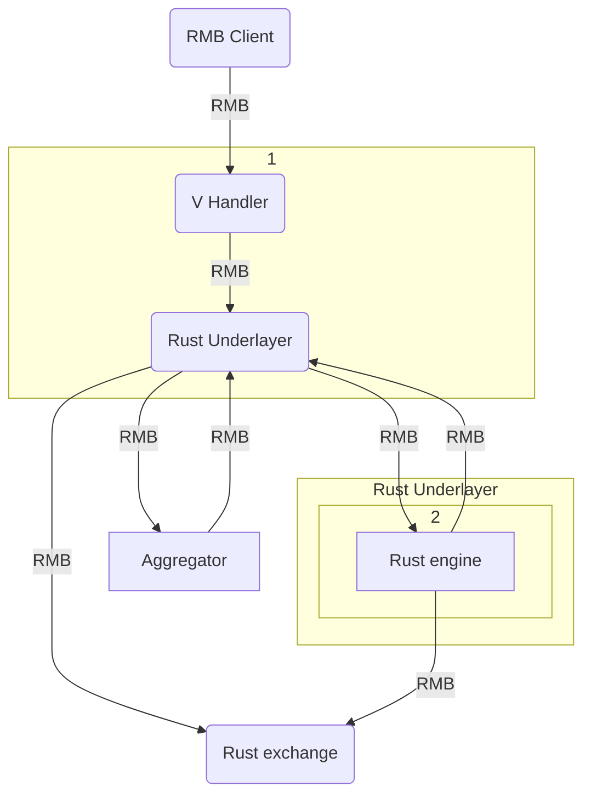

# P2P_RMB_protocol
A Peer-to-Peer communication protocol for Reliable Message Bus

The purpose of this project is to establish a completely decentralized, reliable, peer to peer, efficient and scalable communication protocol for "digital twins" using RMB Clients, Vlang RMB Handlers, Rust engines and reliable message busses. The aim is that through this protocol we can limit the amount we rely on distributed ledgers and blockchain only for currency accounting, and thus be able to build truly decentralized solutions that use data efficiently and can scale easily.

## Infrasture

- The RMB is the communication agent
- The RMB Client is a client side script to send RMB messages to digital twins from UIs. 
- Vlang handlers translate RMB messages to actions in Rust, thus allowing multiple Domain Specific Languages to be built on top without necessitating modifications to the rust underlayer.
- Rust engines communicate with aggregators, and other Rust engines directly or through gossip protocols.
- Rust Blockchain Engine is the endpoint for executing blockchain operations.

### Reliable Message Bus

The reliable message bus is a bus for messaging between RMB clients and agents (message handlers).

- RMB Client: lives in browser, relays message to rmb agent over tf grid.
- RMB Agent: lives in node, users own agent, can relay message to other agent.

### Vlang RMB Handlers (AKA Twin)

The RMB agents in this protocol getting rmb messages from the client and converting them to actions are handlers. The vlang handler then translates this action to commands that it gives out to the rust underlayer.

### Rust underlayer

The layer executing gossipping (future) and blockchain operations when needed through the use of a network of rust engines.

### Protocols

Using this infrastructure, two protocols seem to provide a desirable solution to the purpose. The Cached Gossip Networking Protocol and the Aggregated Networking Protocol. The idea is 

## Cached Gossip Networking Protocol:

A protocol based on gossiping to connect to other agents efficiently, without aggragators.
The user's RMB Agent communicates with other RMB Agents through gossip protocols, to find contacts that fit user's tags. 

### Tags
- category: (clothing, tech, grocery, art, travel, experience ...)
- subcategory: (fruits)
- name: (apple)
- location: (city, country etc.)
- adjective: (organic, pink, cotton, sustainable)

### Gossipping
- gossip is tags that you are searching for (organic apple dubai), your address, and your public key
- you spread gossip to your contacts
- contacts first check their last requests to see if they have responses cached for request
- if yes they return responses to you, if not they check previous gossips to find request.
a. they find request in previous gossips they return you address of requester.
- you contact requester to see if they have your request in cache.
- requester has responses in cache and delivers list to you, or says they dont have response in cache.
b. they don't find request in caches and ask you if you want them to ask their contacts.
- you say yes the cycle continues, you say no if you got responses.

No other data is kept other than request, address and public key.
This way, even if data is corrupted, it doesn't matter.

### Caching & hashing

When RMB Agents that satisfy and respond to the broadcast are found, the conditions and resulting agent address is cached.
The aim of caching is to reduce unnecessary gossipping and increase ease and speed of connections with peers.

- every agent caches responses from last 1000 requests (~50MB at 0.5KB per request, 100 responses per request )
- every agent caches last 10000 gossips (~5MB)
- total 55MB cache

It is like asking your neighbor for a barber, and your neighbor remembering that another friend of theirs also was looking for a barber and telling you to ask them.

Each cache row holds only 3 keys:

Public key (256 bytes) | IPV6 Address (16 bytes) | Tags (~8-256 bytes)

### imAlive

Agents notify their contacts that they're alive in a specified frequency. imAlive ensures broken agents are removed from contact lists.

### Reputation

Reputation is a signed hash by people who access and agents resources. Can't be faked or corrupted, and can be verified using public keys.

### P2P Cryptocurrency Exchange

TRADING
1. User logs in to account, wants to trade bitcoins for tft
2. User event triggers RMB client to relay messages to twin, using the public key associated with account to identify agent. 
3. The twin receives the message, adds it to twin data, and commands the rust underlayer to start gossiping
4. Rust underlayer broadcasts message "tft, public_key, address" to contacts via rust.
6. Eventually a list of results arrive and you broadcast your requests to addresses on list
7. Twin receives trade request, checks if it wants bitcoin, waits for other requests. 
8. If agrees to terms lets know.

BUYING
8. The twin, after receiving confirmation and information on addresses of twins selling TFT, instructs rust underlay to contact each via RMB and set deal.
9. Twin receives trade request, checks if it wants bitcoin, waits for other requests
10. If request terms work twin goes to aggregator  instructs rust underlay to send confirmaton.
11. Twin then encryp

## Aggregated Networking Protocol

Initialization:
1. User creates account, initializes Twin, selects node. 
3. Twin is initialized on the node, creates symmetric encription keypair and returns public key to be associated with user account.
4. User adds wallet to account, wallet information is encrypted and shared with twin. 

### Aggregation

Aggragators keep logs of public addresses associated with certain tags. When an agent is looking for something, the agent goes to the aggragators, fetches lists and contact the addresses on the list to seek.

### imAlive

Agents notify the network that they're alive in a speicifed frequency. imlive ensures broken agents are removed from contact lists.

### Reputation

Reputation damaging activities are also gossipped, and neighboring agents cache the reputation of the corrupt agent.

## P2P Cryptocurrency Exchange

- When a user is looking to sell a cryptocurrency in exchange for another cryptocurrency, the data of the exchange request is registered to the RMB Agent.
- The Buyer Agent gossips their request to buy in increments of 1000$. 
- Once the buyer agent finds the seller, if the agents agree on terms, the exchange protocol is initiated (see below).
- The exchange agent validates that both parties agree on the exchange and executes an atomic swap between TF Grid and other blockchain.

SELLING
1. User logs in to account, wants to trade bitcoins for tft
2. User event triggers RMB client to relay messages to twin, using the public key associated with account to identify agent. 
3. The twin receives the message and commands the rust underlayer to let aggregator know.
4. Rust underlayer sends message to aggregators via rust.
5. Aggragators add user's address into selling bitcoin category.
6. Aggragators send confirmation to twin's rust underlay via rmb, alongside a list of people selling TFT.
7. The rust underlay relays info to twin, twin relays info back to browser, displaying a success message.

BUYING
8. The twin, after receiving confirmation and information on addresses of twins selling TFT, instructs rust underlay to contact each via RMB and set deal.
9. Twin receives trade request, checks if it wants bitcoin, waits for other requests
10. If request terms work twin goes to aggregator  instructs rust underlay to send confirmaton.
11. Twin then encryp

### Exchange Protocol

- To ensure fairness, once the seller agent receives the request, a waiting period is initiated. This allows for the seller to receive other offers and prioritize them to preference. The nearest agent who gossiped to the seller the fastest does not have an advantage over others.
- The seller relays back an answer confirming or denying the transaction. 
- If the seller agrees to the terms of the exchange, the seller agent relays a rmb message to the Rust underlayer giving out the order to initiate the  exchange.
- The Rust underlayer creates and signs the contract, and relays the transaction id to the buyer agent.
- The buyer agent authenticates the contract and signs, and the contract signed by both parties is relayed to the Rust underlayer.
- The Rust underlayer authenticates the signatures of both parties and initiates the atomic swap. (do we need a timelock here to stop other synchronous exchanges or is htlc in atomic swap sufficient?)

## Going forward

Going forward this protocol will be used by the digital twin system to become the protocol for trading and exchanging information between twins, vendors etc.

Notes:

Other info to be stored in basic profile
- geolocation
- url categories
- name ?
- ipv6 address
- epoch of last mod

Url categories super important, every thing is there:
- your profile page
- your merchant page

The hash for these pages are signed to create reputation tracking

Resources:
[Rust gossip crate](https://docs.rs/gossip/latest/gossip/)

